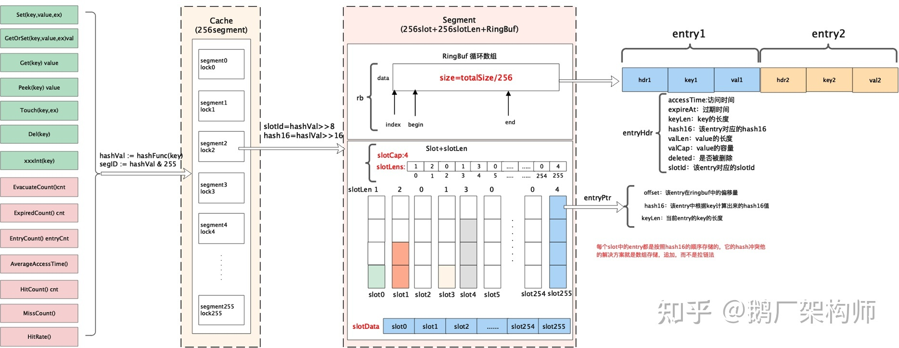
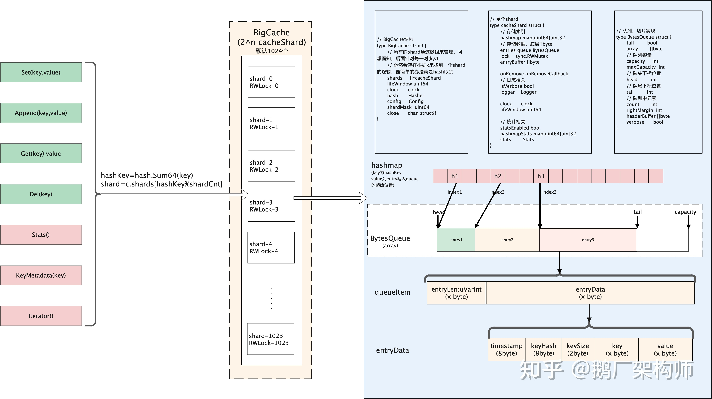

Bigcache 使用多个 sharding，将数据分散到多个 bucket 中，然后每个 bucket 中的数据使用一个类似 LRU 的淘汰算法进行管理。这种方式可以保证并发读写性能非常高，而且缓存的数据量可以很大，适用于需要高并发读写，且数据量较大的场景。但是，由于 Bigcache 使用了多个 shard，因此可能存在一些数据分布不均的问题，同时在某些情况下，缓存数据的淘汰可能并不是最优的。

Freecache 则是使用了一个单一的内存映射文件作为缓存存储，同时使用了类似 LRU 的淘汰算法。这种方式相对于 Bigcache 来说，有更好的数据分布均衡性，并且由于是单一文件，因此在某些场景下也更加方便管理。但是，由于只使用了单个文件，因此在并发读写时可能存在一些瓶颈。

因此，一般来说，如果应用场景需要高并发读写，且数据量较大，建议使用 Bigcache。而如果数据量较小，并且并发读写不是非常高的情况下，可以使用 Freecache。当然，实际应用场景可能会更加复杂，需要根据具体情况来选择适合自己的缓存库。