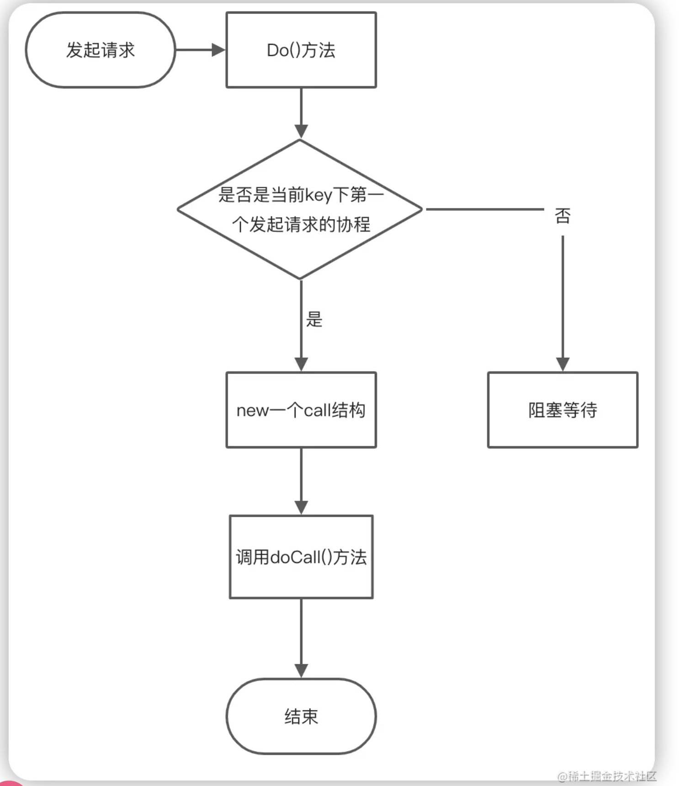

# 结构体

```go
// singleflight
type Group struct {
    mu sync.Mutex       // 互斥锁
    m  map[string]*call // 懒加载
}

// call 执行方法的协程
type call struct {
    wg sync.WaitGroup // 实现其他协程等待
    val interface{} // 返回的结果
    err error // 返回的错误

    dups  int // 合并的并发请求数
    chans []chan<- Result // 存储DoChan()异步返回结果
}

// result 返回结果
type Result struct {
    Val    interface{} // 返回结果
    Err    error // 返回错误
    Shared bool // 是否合并请求
}
```

# 实现流程


